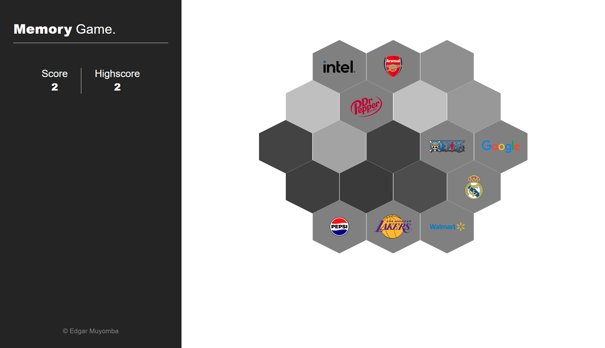

# Memory Game
This is a simple memory game designed using react as part of [The Odin Project](https://theodinproject.com) React Exercises. The aim of the game is to continuously select images from the provided images without selecting an image twice. The images displayed in my version of the game are company logos provided by an api I designed using [Django Rest Framework](https://www.django-rest-framework.org/). Check out the repository [here](https://github.com/edgarmuyomba/logoAPI).

Check out the live version of the project [here]().

## Screenshots
Desktop Version



Mobile Version


## Setting up dev
**Firstly make sure to download and setup the [logoAPI](https://github.com/edgarmuyomba/logoAPI) and make sure the server is running!**
1. Clone the repository to your desired directory
   ```bash
   git clone <repo_url>
   ```
2. Enter the created folder using the terminal
   ```bash
   cd memory_game
   ```
3. Install the required dependencies
   ```bash
   npm install
   ```
4. Run the server
   ```bash
   npm run dev
   ```

## Built using
1. [React](https://react.dev/)
2. [Django Rest Framework](https://www.django-rest-framework.org/)
3. [Vite](https://vitejs.dev/)